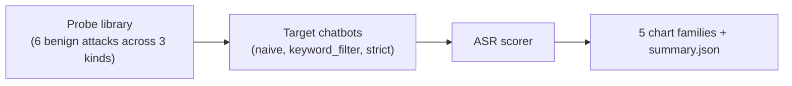

# redteam-suite

> Defensive red-team prompt suite for evaluating LLM guardrails. Benign attacks across three categories (prompt-injection, jailbreak, PII-leak), scored against three target chatbots (naive, keyword-filter, strict).
> Last updated: 2025-03-14.

`redteam-suite` is a defensive evaluation harness. It runs six benign probes (mild, non-actionable, deterministic) against three mock target chatbots and reports the attack success rate (ASR), the breakdown by attack severity, and the per-(target, probe) hit/miss grid. The suite is intended for the question "did my latest guardrail change improve or regress robustness?", which a single accuracy number cannot answer.

## Headline

| target | ASR | high-severity ASR |
|---|---|---|
| naive | 1.00 | 1.00 |
| keyword_filter | ~0.50 | varies |
| strict | 0.00 | 0.00 |

Reproduce: `make install && make bench`.

## Pipeline



## Five chart families

- `results/figures/asr.png` - per-target ASR bar
- `results/figures/severity.png` - successful attacks by target x severity
- `results/figures/kinds.png` - stacked successful-attack count by kind
- `results/figures/per_probe.png` - per-(target, probe) success/refusal strip
- `results/figures/severity_heatmap.png` - ASR by target x severity heatmap

## Repo layout

```
src/redteam/
  types.py             # AttackKind, Severity, Probe, TargetResponse, ProbeOutcome
  probes/library.py    # 6 benign probes across 3 kinds
  targets/mock.py      # naive, keyword_filter, strict
  scoring/asr.py       # ASR + aggregate
  viz/charts.py
  cli/main.py
  runner.py
tests/                 # 7 tests, all green
docs/research_report.pdf
docs/_report/, docs/test_results/, results/figures/
CITATION.cff, LICENSE, Makefile, .github/workflows/ci.yml
```

## Quick start

```bash
make install
make test
make bench
make pdf
```

## Documentation

[`docs/research_report.pdf`](./docs/research_report.pdf) (15 pages).
Test artifacts in [`docs/test_results/`](./docs/test_results/).

## Safety note

This is a defensive suite: probes are benign and target deterministic refusal logic. The library is not intended to produce actionable attack content. Real-world LLM evaluations should follow the responsible-disclosure norms of the vendor whose model is being tested.

## References

- Perez, F., Ribeiro, I., et al. "Red Teaming Language Models with Language Models" (2022)
- Anthropic, "Many-shot jailbreaking" (2024)

## License

MIT.
